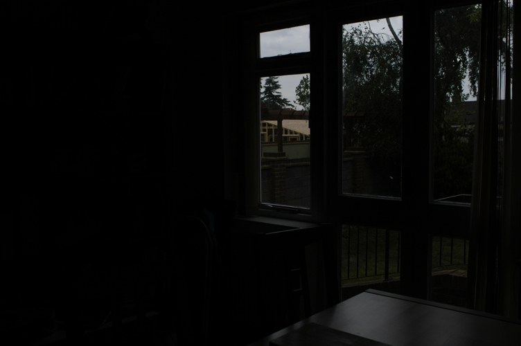
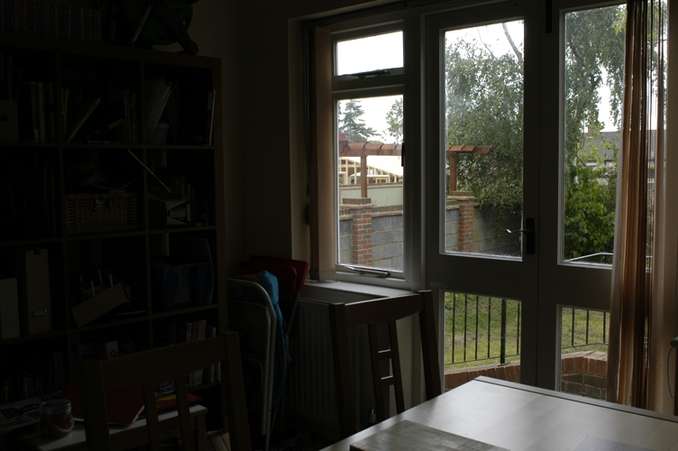
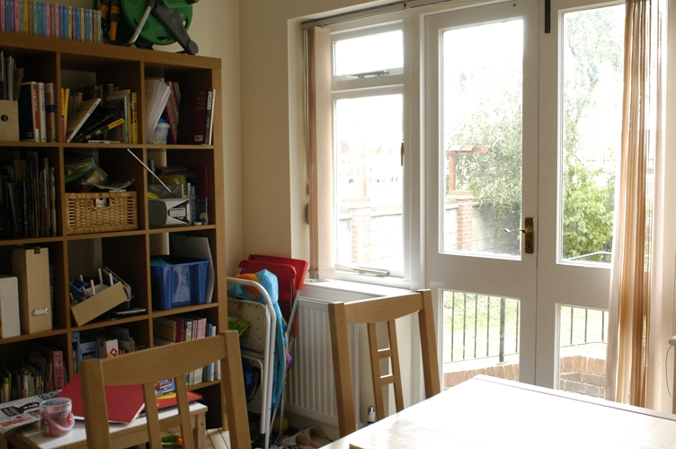
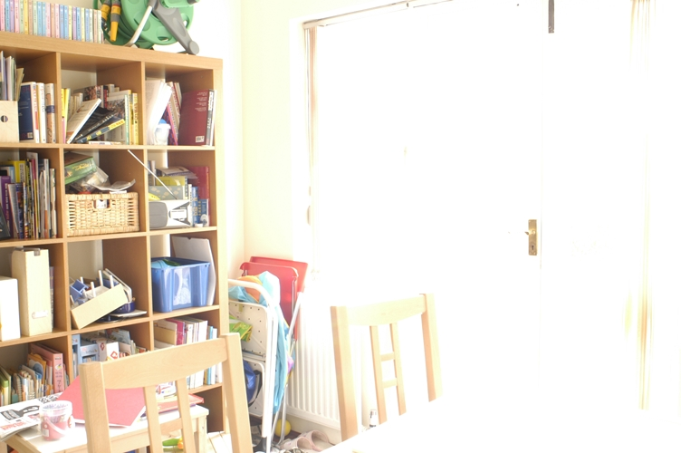
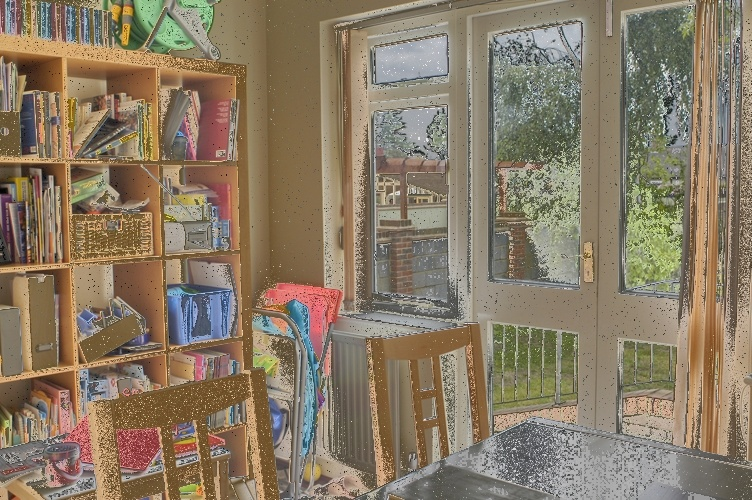
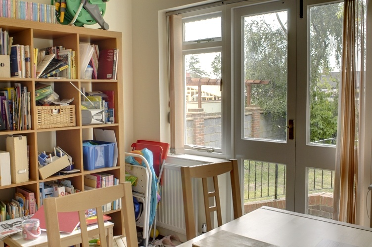

# Exposure Fusion

Python implementation of Exposure Fusion.

Here are some photos with different exposures:

|  |  |  |  |
|------------------------|------------------------|------------------------|------------------------|

Here is the result of exposure fusion using the naive implementation:

Here is the result of exposure fusion using the Gaussian kernel:

Here is the result of exposure fusion using Gaussian pyramid and Laplacian pyramid:

## Usage
1. Put photos with different exposures into the `pics` folder.
2. Run `main.py`

## References
[1]: T. Mertens, J. Kautz and F. Van Reeth, "Exposure Fusion," 15th Pacific Conference on Computer Graphics and Applications (PG'07), Maui, HI, USA, 2007, pp. 382-390, doi: 10.1109/PG.2007.17.
